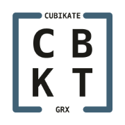
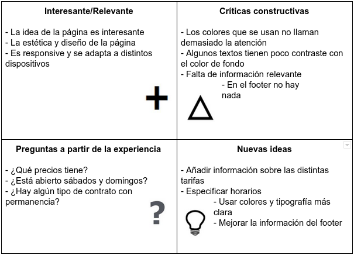
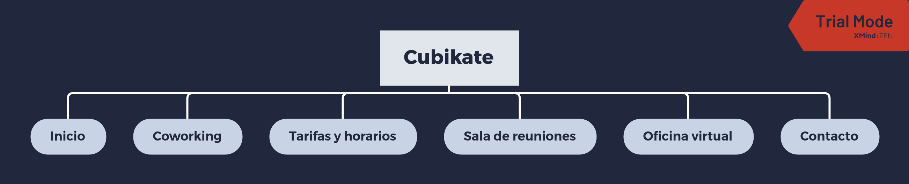
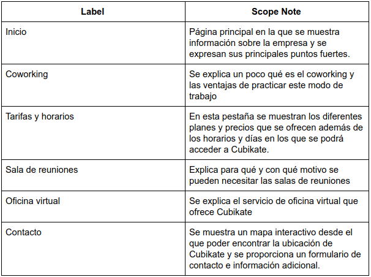
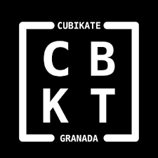

# Trabajo final DIU

Grupo: DIU1.Hookah  Curso: 2019/20 

Proyecto: Cubikate

Descripción: Voy a analizar la página de [**Cubikate**][Cubikate], una página de *coworking* en granada, para intentar proponer mejoras que la hagan más atractiva para el usuario.

Logo: </img>

Realizador
 * :bust_in_silhouette:   Raúl Soria González     :octocat: raulsoria98

----- 

En este trabajo estudiaremos la página de [**Cubikate**][Cubikate] para intentar mejorar ciertos aspectos de su interfaz de usuario.

Qué es *coworking*: Es una forma de trabajo que permite a profesionales independientes, emprendedores, y pymes de diferentes sectores, compartir un mismo espacio de trabajo, tanto físico como virtual, para desarrollar sus proyectos profesionales de manera independiente, a la vez que fomentan proyectos conjuntos. https://es.wikipedia.org/wiki/Trabajo_cooperativo

# Proceso de Diseño 

## Paso 1. UX Desk Research & Analisis 

 1.a Competitive Analysis
-----

[Cubikate][Cubikate] es una empresa de *coworking* que trabaja en Granada ofreciendo su servicio en el centro de la ciudad, este es uno de sus principales puntos fuertes.

En Granada hay otras alternativas de *coworking* como podría ser [***ErranT***][ErranT], otra empresa que ofrece un servicio similar en la ciudad.

 1.b Persona
-----

He creado una persona ficticia que va a utilizar esta página para encontrar un espacio en el que poder trabajar.

He elegido a [Jon][Persona Jon] porque es una persona que realmente necesita un espacio en el que trabajar en su start-up pero no tiene una oficina o un lugar en el que poder centrarse. Además al trabajar junto otras personas de distintos campos, podría encontrar nuevos socios y alguna forma de impulsar su proyecto.

 1.c User Journey Map
----

La UX de Jon nos plantea el problema que tiene la página con respecto a las tarifas, que no se ofrece ningún tipo de información acerca del precio. También plantea el posible excesivo precio que tiene el coworking en general.

[Journey Map Jon][Mapa Jon]

 1.d Usability Review
----

La página está bien estructurada aunque se pueden mejorar algunos detalles como que no haya información sobre el precio, que me parece bastante importante. También se podrán mejorar algunos colores de contraste o una tipografía un poco más grande en algunas partes ya que para alguien con problemas de vista puede llegar a ser un poco difícil.
 También he detectado que hay algunas partes de la página que se repiten en varias secciones de esta.
 La página es Responsive y se adapta a distintos dispositivos de manera correcta, esto es un gran punto a favor.

## Paso 2. UX Design  

 2.a Feedback Capture Grid
----

Sería importante mejorar la legibilidad en algunas zonas, mostrar algo más de información y mejorar el footer.

 2.b Tasks & Sitemap 
-----

 2.c Labelling 
----

 2.d Wireframes
-----

La estética del sitio está bastante bien conseguida. Tan sólo sería necesario añadir esa página en la que el usuario pudiera consultar tarifas y horarios, además de añadir un mismo footer para todas las páginas del sitio web que mostrase alguna información relevante para el usuario.

[Boceto Tarifas y Horarios][Boceto]

## Paso 3. Mi UX-Case Study 

  3.a Logotipo
----
</img>

El logotipo me parece que es bastante correcto ya que es simple pero bonito y llamativo a la vez, además se le puden aplicar otros colores en caso de querer hacer un posible modo oscuro.

Posible cambio de colores para modo oscuro: 
</img>

  3.b Guidelines
----

En cuanto a los elementos de diseño que utilizar, me parece que una de las cosas más importantes que habría que corregir es el contraste que hay en algunos textos con el fondo ya que resulta algo tedioso de leer.
 También respecto al texto sería conveniente utilizar un tamaño de letra algo más grande en algunas partes de la página, por ejemplo en los botones `Solicitar Presupuesto` se hace complicado de leer y más para una persona con problemas de vista.

Las galerías de fotos no funcionan como deberían, se ven las miniaturas e incluso al pasar el puntero por encima parece que hace un efecto pero al hacer click no se agrandan y no podemos ver las imágenes en grande.

Se podría también añadir una caja de búsqueda para llegar rápidamente al contenido de interés, aunque esta puede ser secundaria debido al poco contenido que tiene la página (debido a su naturaleza) y poca profundidad del sitemap.

## Paso 5. Evaluación de Accesibilidad  

  5.a Accesibility evaluation Report
----

En cuanto a la accesibilidad los principales problemas son los comentados anteriormente, el poco contraste de algunos textos con su fondo y el pequeño tamaño de algunos textos. Estos dos problemas juntos podrían ocasionar grandes dificultades para gente con problemas de visión.

Tabién se hecha en falta alguna opción para visualizar la página en distintos idiomas (al menos en inglés además del español), ya que esta alternativa de trabajo puede interesar también a gente extangera que no hable el español. Esto es un punto que sí que tienen otras empresas de coworking como [ErranT][ErranT].

Por otro lado destacar que los botones son grandes lo que facilita bastante que personas con parkinson por ejemplo puedan pulsarlos y moverse por el sitio web con facilidad.

[Persona Jon]:img/persona_jon.png
[Mapa Jon]:img/mapa_jon.png
[Boceto]:img/boceto_tarifas_horarios.jpg

[Cubikate]:https://cubikate.es/
[ErranT]:https://www.errant.es/es/